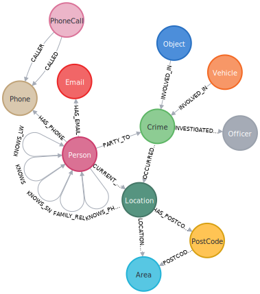
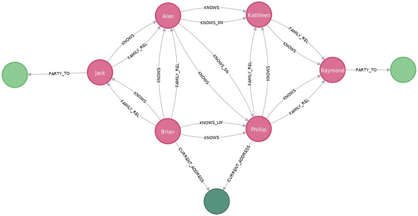
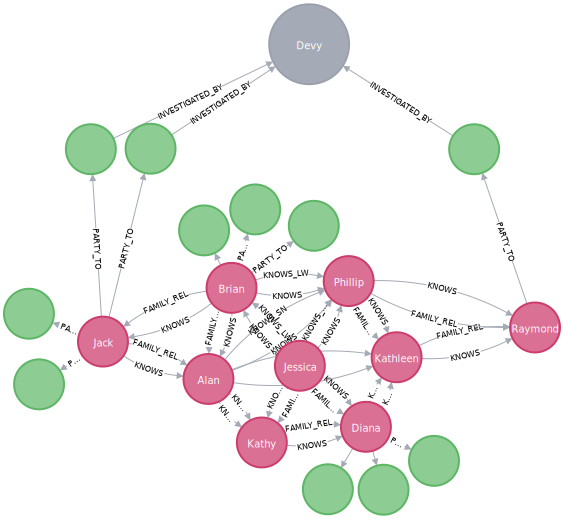
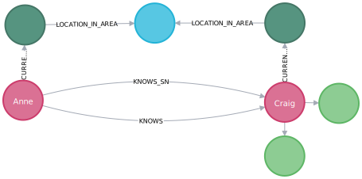
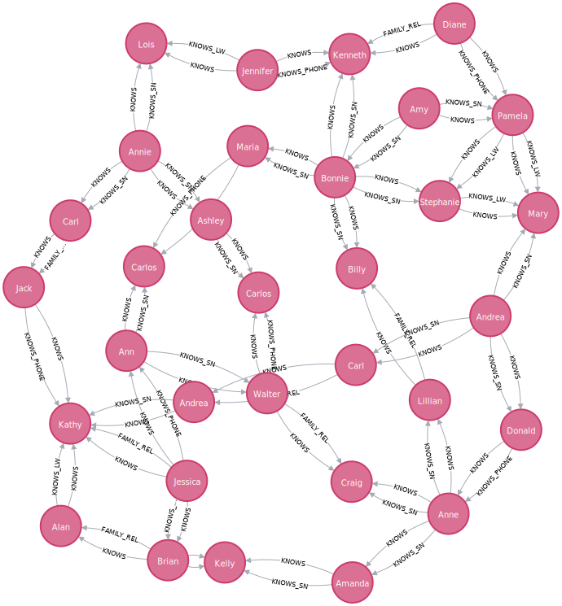
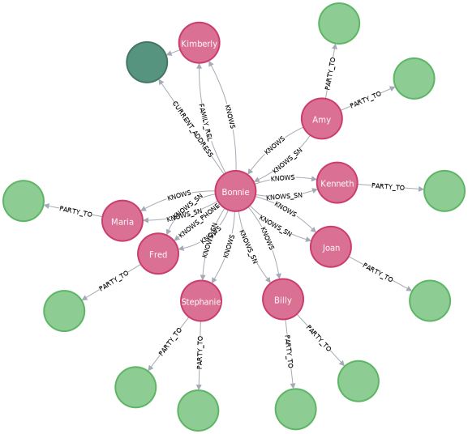
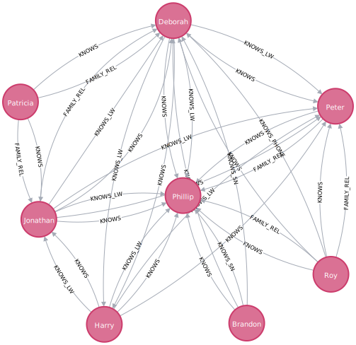
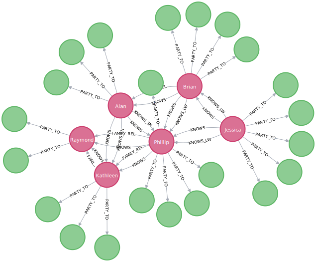
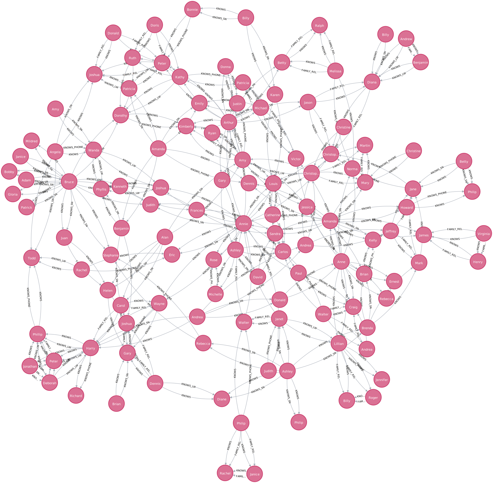

# Crime Investigation

police and child protection investigations.

## POLE Model


The POLE data model focuses on four basic types of entities and the relationships between them: 

- Persons
- Objects
- Locations
- Events

### Use Cases

Graphs are a perfect fit with highly connected data in real time.

- Policing
- Counter Terrorism
- Border Control / Immigration
- Child Protection / Social Services
- Missing Persons
- Offender Rehabilitation
- Insurance Fraud Investigations

### Data

- This demo uses street crime data for Greater Manchester, UK from August 2017.
- it supplies only crime and location data: Locations and Events
- https://data.gov.uk

---

## General Queries

### Schema

```sql
call db.schema.visualization
```



### Crime totals

```sql
MATCH (c:Crime)
RETURN c.type AS crime_type, count(c) AS total
ORDER BY count(c) DESC
```

|"crime_type"                  |"total"|
|------------------------------|-------|
|"Violence and sexual offences"|8765   |
|"Public order"                |4839   |
|"Criminal damage and arson"   |3587   |
|"Burglary"                    |2807   |
|"Vehicle crime"               |2598   |
|"Other theft"                 |2140   |
|"Shoplifting"                 |1427   |
|"Other crime"                 |651    |
|"Robbery"                     |541    |
|"Theft from the person"       |423    |
|"Bicycle theft"               |414    |
|"Drugs"                       |333    |
|"Possession of weapons"       |236    |
|null                          |1      |

### Top locations for crimes

```sql
MATCH (l:Location)<-[:OCCURRED_AT]-(:Crime)
RETURN l.address AS address, l.postcode AS postcode, count(l) AS total
ORDER BY count(l) DESC
LIMIT 15
```

|"address"            |"postcode"|"total"|
|---------------------|----------|-------|
|"Piccadilly"         |"M1 1LU"  |166    |
|"Shopping Area"      |"M60 1TA" |111    |
|"Prison"             |"M60 9AH" |48     |
|"Shopping Area"      |"M4 3AL"  |46     |
|"Nightclub"          |"M1 3LZ"  |41     |
|"Parking Area"       |"M90 2AY" |38     |
|"Supermarket"        |"WN7 5SJ" |38     |
|"Nightclub"          |"M4 2BS"  |36     |
|"182 Waterson Avenue"|"M40 9BY" |35     |
|"43 Walker's Croft"  |"M3 1DA"  |35     |
|"Nightclub"          |"M1 3WB"  |34     |
|"Parking Area"       |"M1 3HF"  |33     |
|"Bus/Coach Station"  |"OL1 1QN" |32     |
|"136 A5185"          |"M6 8FQ"  |30     |
|"Hospital"           |"M13 9WL" |30     |

### Crimes near a particular address

```sql
MATCH (l:Location {address: '1 Coronation Street', postcode: 'M5 3RW'}) return l
-- {"postcode":"M5 3RW","address":"1 Coronation Street","latitude":53.476705,"longitude":-2.272913}
```

```sql
MATCH (l:Location {address: '1 Coronation Street', postcode: 'M5 3RW'}) return point(l)
-- point({srid:4326, x:-2.272913, y:53.476705})
```

```sql
MATCH (l:Location {address: '1 Coronation Street', postcode: 'M5 3RW'}) WITH point(l) AS corrie
MATCH (x:Location)-[:HAS_POSTCODE]->(p:PostCode), (x)<-[:OCCURRED_AT]-(c:Crime) WITH x, p, c, distance(point(x), corrie) AS distance
WHERE distance < 500
RETURN x.address AS address, p.code AS postcode, count(c) AS crime_total, collect(distinct(c.type)) AS crime_type, distance
ORDER BY distance LIMIT 10
```

|"address"               |"postcode"|"crime_total"|"crime_type"                                                   |"distance"        |
|------------------------|----------|-------------|---------------------------------------------------------------|------------------|
|"1 Coronation Street"   |"M5 3RW"  |3            |["Bicycle theft","Violence and sexual offences","Public order"]|0.0               |
|"158 Gloucester Street" |"M5 3SG"  |1            |["Public order"]                                               |104.1354489517625 |
|"147 West Crown Avenue" |"M5 3WT"  |3            |["Public order","Shoplifting"]                                 |162.54121621528688|
|"170 Chancel Avenue"    |"M5 3SJ"  |1            |["Violence and sexual offences"]                               |165.7102054854755 |
|"157 Parish View"       |"M5 3PA"  |1            |["Burglary"]                                                   |175.47453728972013|
|"65 West Bank Street"   |"M5 3GY"  |1            |["Public order"]                                               |237.15914155050027|
|"160 Carmel Close"      |"M5 3LR"  |1            |["Burglary"]                                                   |242.82251946889645|
|"66 Brassington Avenue" |"M5 3JX"  |1            |["Violence and sexual offences"]                               |279.8874106950031 |
|"141 Garden Wall Close" |"M5 3GQ"  |1            |["Vehicle crime"]                                              |289.88766629407894|
|"153 Robert Hall Street"|"M5 3PT"  |2            |["Public order","Criminal damage and arson"]                   |296.7257174132251 |

### Crimes investigated by Inspector Morse

```sql
MATCH (o:Officer {rank: 'Chief Inspector', surname: 'Morse'})<-[i:INVESTIGATED_BY]-(c:Crime)
RETURN *
```

### Crimes under investigation by Officer Larive

```sql
MATCH (c:Crime {last_outcome: 'Under investigation'})-[i:INVESTIGATED_BY]->(o:Officer {badge_no: '26-5234182', surname: 'Larive'})
return *
```

### Shortest path between persons related to crimes

[UNWIND](https://neo4j.com/docs/cypher-manual/current/clauses/unwind/)

```sql
UNWIND [1, 2, 3, NULL ] AS x RETURN x, 'val' AS y
-- x: 1, 2, 3, <null>
-- y: val, val, val, val
```

```sql
MATCH 
(c:Crime {last_outcome: 'Under investigation', type: 'Drugs'})-[:INVESTIGATED_BY]->(:Officer {badge_no: '26-5234182'}),
(c)<-[:PARTY_TO]-(p:Person)
WITH COLLECT(p) AS persons
UNWIND persons AS p1
UNWIND persons AS p2
WITH * WHERE id(p1) < id(p2)
MATCH path = allshortestpaths((p1)-[:KNOWS|KNOWS_LW|KNOWS_SN|FAMILY_REL|KNOWS_PHONE*..3]-(p2))
RETURN path
```



### Other related people associated with drugs crimes

```sql
MATCH path = (:Officer {badge_no: '26-5234182'})<-[:INVESTIGATED_BY]-(:Crime {type: 'Drugs'})<-[:PARTY_TO]-(:Person)-[:KNOWS*..3]-(:Person)-[:PARTY_TO]->(:Crime {type: 'Drugs'})
RETURN path
```



---

## Vulnerable Persons Investigation

### 

```sql
MATCH (p:Person)-[:KNOWS]-(friend)-[:PARTY_TO]->(:Crime)
WHERE NOT (p:Person)-[:PARTY_TO]->(:Crime)
RETURN p.name AS name, p.surname AS surname, p.nhs_no AS id, count(distinct friend) AS dangerousFriends
ORDER BY dangerousFriends DESC
LIMIT 5
```

|"name"  |"surname"  |"id"         |"dangerousFriends"|
|--------|-----------|-------------|------------------|
|"Anne"  |"Freeman"  |"804-54-6976"|8                 |
|"Bonnie"|"Gilbert"  |"622-53-3302"|7                 |
|"Ashley"|"Robertson"|"554-93-4466"|5                 |
|"Kathy" |"Wheeler"  |"218-31-0921"|3                 |
|"Pamela"|"Gibson"   |"838-11-7607"|2                 |

### Friends of Friends

```sql
MATCH (p:Person)-[:KNOWS*1..2]-(friend)-[:PARTY_TO]->(:Crime)
WHERE NOT (p:Person)-[:PARTY_TO]->(:Crime)
RETURN p.name AS name, p.surname AS surname, p.nhs_no AS id, count(distinct friend) AS dangerousFriends
ORDER BY dangerousFriends DESC
LIMIT 5
```

|"name"    |"surname"  |"id"         |"dangerousFriends"|
|----------|-----------|-------------|------------------|
|"Anne"    |"Freeman"  |"804-54-6976"|10                |
|"Bonnie"  |"Gilbert"  |"622-53-3302"|8                 |
|"Ann"     |"Fox"      |"576-99-9244"|7                 |
|"Phillip" |"Myers"    |"627-15-0737"|7                 |
|"Kimberly"|"Alexander"|"548-59-5017"|7                 |

### Exploring a Vulnerable Person’s graph

```sql
MATCH path = (:Location)<-[:CURRENT_ADDRESS]-(:Person {nhs_no: '804-54-6976', surname: 'Freeman'})-[:KNOWS]-(:Person)-[:PARTY_TO]->(:Crime)
RETURN path
```

### Looking for local Dangerous Friends

```sql
MATCH (anne:Person {nhs_no: '804-54-6976', surname: 'Freeman'})-[k:KNOWS]-(friend)-[pt:PARTY_TO]->(c:Crime),
(anne)-[ca1:CURRENT_ADDRESS]->(aAddress)-[lia1:LOCATION_IN_AREA]->(area),
(friend)-[ca2:CURRENT_ADDRESS]->(fAddress)-[lia2:LOCATION_IN_AREA]->(area)
RETURN *
```



### Looking for connections between Vulnerable Persons

```sql
MATCH (p:Person)-[:KNOWS]-(friend)-[:PARTY_TO]->(:Crime)
WHERE NOT (p:Person)-[:PARTY_TO]->(:Crime)
WITH p, count(distinct friend) AS dangerousFriends
ORDER BY dangerousFriends DESC
LIMIT 5
WITH COLLECT (p) AS people
UNWIND people AS p1
UNWIND people AS p2
WITH * WHERE id(p1) <> id (p2)
MATCH path = shortestpath((p1)-[:KNOWS*]-(p2))
RETURN path
```



### Looking for Dangerous Family Friends

```sql
MATCH (p:Person)-[:FAMILY_REL]-(relative)-[:KNOWS]-(famFriend)-[:PARTY_TO]->(:Crime)
WHERE NOT (p:Person)-[:PARTY_TO]->(:Crime) AND
 NOT (relative)-[:PARTY_TO]->(:Crime)
RETURN p.name AS name, p.surname AS surname, p.nhs_no AS id, count(DISTINCT famFriend) AS DangerousFamilyFriends
ORDER BY DangerousFamilyFriends DESC
LIMIT 6
```

|"name"    |"surname"  |"id"         |"DangerousFamilyFriends"|
|----------|-----------|-------------|------------------------|
|"Kimberly"|"Alexander"|"548-59-5017"|7                       |
|"Walter"  |"Wheeler"  |"263-14-7231"|2                       |
|"Kimberly"|"Wood"     |"859-40-9947"|2                       |
|"Henry"   |"Palmer"   |"219-06-7487"|2                       |
|"Andrea"  |"Moreno"   |"240-77-5251"|2                       |
|"Martin"  |"Daniels"  |"872-88-7149"|1                       |

### Looking for Dangerous Family Friends

```sql
MATCH (p:Person)-[:FAMILY_REL]-(relative)-[:KNOWS]-(famFriend)-[:PARTY_TO]->(:Crime),
(p)-[:CURRENT_ADDRESS]->(:Location)<-[:CURRENT_ADDRESS]-(relative)
WHERE NOT (p:Person)-[:PARTY_TO]->(:Crime) AND
 NOT (relative)-[:PARTY_TO]->(:Crime)
RETURN p.name AS name, p.surname AS surname, p.nhs_no AS id, count(DISTINCT famFriend) AS DangerousFamilyFriends
ORDER BY DangerousFamilyFriends DESC
LIMIT 5
```

|"name"    |"surname"  |"id"         |"DangerousFamilyFriends"|
|----------|-----------|-------------|------------------------|
|"Kimberly"|"Alexander"|"548-59-5017"|7                       |
|"Martin"  |"Daniels"  |"872-88-7149"|1                       |

### Exploring a Vulnerable Person’s graph

```sql
MATCH path = (relative:Person)-[:CURRENT_ADDRESS]->(:Location)<-[:CURRENT_ADDRESS]-(:Person {nhs_no: '548-59-5017', surname: 'Alexander'})-[:FAMILY_REL]-(relative)-[:KNOWS]-(:Person)-[:PARTY_TO]->(:Crime)
RETURN path
```



---

## Graph Algorithms

### Triangle Count

```sql
CALL algo.triangleCount.stream('Person', 'KNOWS', {concurrency:4})
YIELD nodeId, triangles
MATCH (p:Person)
WHERE ID(p) = nodeId AND triangles > 0
RETURN p.name AS name, p.surname AS surname, p.nhs_no AS id, triangles
ORDER BY triangles DESC
LIMIT 10;
```

### Triangle Count

```sql
MATCH path = (p1:Person {nhs_no: '838-45-9343', surname: 'Ford'})-[:KNOWS]-(p2)-[:KNOWS]-(p3)-[:KNOWS]-(p1)
RETURN path
```



### Triangle Count on a Subgraph

```sql
CALL algo.triangleCount.stream('MATCH (p:Person)-[:PARTY_TO]->(c:Crime) RETURN id(p) AS id', 'MATCH (p1:Person)-[:KNOWS]-(p2:Person) RETURN id(p1) AS source, id(p2) AS target', {concurrency:4, graph:'cypher'})
YIELD nodeId, triangles
MATCH (p:Person)
WHERE ID(p) = nodeId AND
triangles > 0
RETURN p.name AS name, p.surname AS surname, p.nhs_no AS id, triangles
ORDER BY triangles DESC
LIMIT 5;
```

### Triangle Count on a Subgraph

```sql
MATCH (p1:Person {nhs_no: '337-28-4424', surname: 'Williamson'})-[k1:KNOWS]-(p2)-[k2:KNOWS]-(p3)-[k3:KNOWS]-(p1)
WITH *
MATCH (person)-[pt:PARTY_TO]->(crime) WHERE person IN[p1, p2, p3]
RETURN *
```



### Betweenness Centrality

```sql
CALL algo.betweenness.stream('Person', 'KNOWS', {direction: 'both'})
YIELD nodeId, centrality
MATCH (p:Person)
WHERE ID(p) = nodeId
RETURN p.name AS name, p.surname AS surname, p.nhs_no AS id, toInt(centrality) AS score
ORDER BY centrality DESC
LIMIT 10;
```

### Betweenness Centrality

```sql
MATCH path = (:Person {nhs_no: '863-96-9468', surname: 'Duncan'})-[:KNOWS*..3]-(:Person)
RETURN path
```


