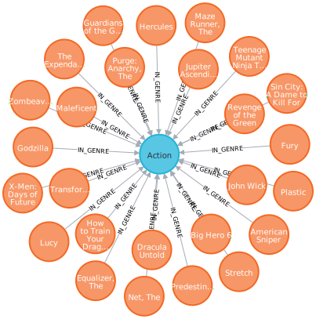

# Personalized Product Recommendations

Guides: [Recommendations](https://guides.neo4j.com/sandbox/recommendations/index.html)


Benefits of using graphs to generate recommendations:
1. **Performance**. calculating recommendations in real time.
1. **Data model**. combining datasets in data silos is easy.

## Open Movie Graph Data Model


### Property Graph Model

The data model of graph databases is called the labeled property graph model.

- **Nodes**: The entities in the data.
- **Labels**: Each node can have one or more label that specifies the type of the node.
- **Relationships**: Connect two nodes. They have a single direction and type.
- **Properties**: Key-value pair properties can be stored on both nodes and relationships.

### Eliminate Data Silos

combine data from multiple silos.

- **Product Catalog**: Data describing movies comes from the **product catalog** silo.
- **User Purchases / Reviews**: Data on user purchases and reviews comes from the **user** or **transaction** silo.

## Cypher

we need a query language for graphs.

```sql
MATCH (m:Movie)<-[:RATED]-(u:User)
WHERE m.title CONTAINS "Matrix" -- filter
WITH m.title AS movie, COUNT(*) AS reviews -- aggregate
RETURN movie, reviews
ORDER BY reviews DESC
LIMIT 5;
```

|"movie"                  |"reviews"|
|-------------------------|---------|
|"Matrix, The"            |259      |
|"Matrix Reloaded, The"   |82       |
|"Matrix Revolutions, The"|54       |

## Personalized Recommendations

### Content-Based Filtering

Recommend items that are similar to those that a user is viewing, rated highly or purchased previously.


> Products similar to the product you’re looking at now

```sql
MATCH p=(m:Movie {title: "Net, The"})-[:ACTED_IN|IN_GENRE|DIRECTED*2]-()
RETURN p LIMIT 25
```



### Collaborative Filtering

Use the preferences, ratings and actions of other users in the network to find items to recommend.


> Users who bought this thing, also bought that other thing.

```sql
MATCH (m:Movie {title: "Crimson Tide"})<-[:RATED]-(u:User)-[:RATED]->(rec:Movie)
RETURN rec.title AS recommendation, COUNT(*) AS usersWhoAlsoWatched
ORDER BY usersWhoAlsoWatched DESC LIMIT 25
```

|"recommendation"            |"usersWhoAlsoWatched"|
|----------------------------|---------------------|
|"Forrest Gump"              |70                   |
|"Pulp Fiction"              |68                   |
|"Dances with Wolves"        |68                   |
|"Fugitive, The"             |65                   |

## Content-Based Filtering

The goal of content-based filtering is to find similar items, using attributes (or traits) of the item. We could define similarlity is movies that have common genres.


### Similarity Based on Common Genres

Find movies most similar to Inception based on shared genres:

```sql
MATCH (m:Movie)-[:IN_GENRE]->(g:Genre)<-[:IN_GENRE]-(rec:Movie)
WHERE m.title = "Inception"
WITH rec, COLLECT(g.name) AS genres, COUNT(*) AS commonGenres
RETURN rec.title, genres, commonGenres
ORDER BY commonGenres DESC LIMIT 10
```

|"rec.title"                                                   |"genres"                                                |"commonGenres"|
|--------------------------------------------------------------|--------------------------------------------------------|--------------|
|"Patlabor: The Movie (Kidô keisatsu patorebâ: The Movie)"     |["Crime","Drama","Mystery","Sci-Fi","Thriller","Action"]|6             |
|"Strange Days"                                                |["Crime","Drama","Mystery","Sci-Fi","Thriller","Action"]|6             |
|"Watchmen"                                                    |["Drama","Mystery","Sci-Fi","Thriller","IMAX","Action"] |6             |
|"Sherlock: The Abominable Bride"                              |["Crime","Drama","Mystery","Thriller","Action"]         |5             |
|"Double, The"                                                 |["Crime","Drama","Mystery","Thriller","Action"]         |5             |
|"Whiteout"                                                    |["Crime","Drama","Mystery","Thriller","Action"]         |5             |

### Personalized Recommendations Based on Genres

If we know what movies a user has watched, we can use this information to recommend similar movies:

```sql
MATCH (u:User {name: "Angelica Rodriguez"})-[r:RATED]->(m:Movie),
  (m)-[:IN_GENRE]->(g:Genre)<-[:IN_GENRE]-(rec:Movie)
WHERE NOT EXISTS( (u)-[:RATED]->(rec) )
WITH rec, [g.name, COUNT(*)] AS scores
RETURN rec.title AS recommendation, rec.year AS year,
COLLECT(scores) AS scoreComponents,
REDUCE (s=0,x in COLLECT(scores) | s+x[1]) AS score
ORDER BY score DESC LIMIT 10
```

|"recommendation" |"year"|"scoreComponents"                                                                                                           |"score"|
|-----------------|------|----------------------------------------------------------------------------------------------------------------------------|-------|
|"Rubber"         |2010  |[["Adventure",5],["Comedy",10],["Drama",4],["Action",6],["Crime",2],["Thriller",6],["Horror",1],["Mystery",1],["Western",2]]|37     |
|"Motorama"       |1991  |[["Adventure",5],["Comedy",10],["Fantasy",3],["Drama",4],["Crime",2],["Thriller",6],["Mystery",1],["Sci-Fi",2]]             |33     |
|"Stunt Man, The" |1980  |[["Adventure",5],["Comedy",10],["Drama",4],["Action",6],["Thriller",6]]                                                     |31     |
|"Mummy, The"     |1999  |[["Adventure",5],["Comedy",10],["Fantasy",3],["Action",6],["Thriller",6],["Horror",1]]                                      |31     |


### Weighted Content Algorithm

Of course there are many more traits in addition to just genre that we can consider to compute similarity, such actors and directors. Let’s use a weighted sum to score the recommendations based on the number of actors, genres and directors they have in common to boost the score:

```sql
MATCH (m:Movie) WHERE m.title = "Wizard of Oz, The"
MATCH (m)-[:IN_GENRE]->(g:Genre)<-[:IN_GENRE]-(rec:Movie)

WITH m, rec, COUNT(*) AS gs

OPTIONAL MATCH (m)<-[:ACTED_IN]-(a:Actor)-[:ACTED_IN]->(rec)
WITH m, rec, gs, COUNT(a) AS as

OPTIONAL MATCH (m)<-[:DIRECTED]-(d:Director)-[:DIRECTED]->(rec)
WITH m, rec, gs, as, COUNT(d) AS ds

RETURN rec.title AS recommendation, (5*gs)+(3*as)+(4*ds) AS score ORDER BY score DESC LIMIT 100
```

|"recommendation"         |"score"|
|-------------------------|-------|
|"Wiz, The"               |20     |
|"Chitty Chitty Bang Bang"|20     |
|"Enchanted"              |20     |
|"Gnome-Mobile, The"      |20     |
|"Quest for Camelot"      |20     |

## Content-Based Similarity Metrics

**Similarity metrics** used in generating personalized recommendations. To quantify how similar two items are.

### Jaccard Index


0 ~ 1: how similar two sets are.
  - 0: two sets don't have a common.
  - 1: two identical sets.

**What movies are most similar to Inception based on Jaccard similarity of genres?**

```sql
MATCH (m:Movie {title: "Inception"})-[:IN_GENRE]->(g:Genre)<-[:IN_GENRE]-(other:Movie)
WITH m, other, COUNT(g) AS intersection, COLLECT(g.name) AS i
MATCH (m)-[:IN_GENRE]->(mg:Genre)
WITH m,other, intersection,i, COLLECT(mg.name) AS s1
MATCH (other)-[:IN_GENRE]->(og:Genre)
WITH m,other,intersection,i, s1, COLLECT(og.name) AS s2

WITH m,other,intersection,s1,s2

WITH m,other,intersection,s1+[x IN s2 WHERE NOT x IN s1] AS union, s1, s2

RETURN m.title, other.title, s1,s2,((1.0*intersection)/SIZE(union)) AS jaccard ORDER BY jaccard DESC LIMIT 100
```

|"m.title"  |"other.title"|"s1"|"s2"|"jaccard"|
|---|---|---|---|---|
|"Inception"|"Strange Days"|["Crime","Drama","Mystery","Sci-Fi","Thriller","IMAX","Action"]|["Crime","Action","Thriller","Sci-Fi","Mystery","Drama"]|0.8571428571428571|
|"Inception"|"Watchmen"|["Crime","Drama","Mystery","Sci-Fi","Thriller","IMAX","Action"]|["Drama","Action","Sci-Fi","Mystery","IMAX","Thriller"]|0.8571428571428571|
|"Inception"|"Sherlock: The Abominable Bride"|["Crime","Drama","Mystery","Sci-Fi","Thriller","IMAX","Action"]|["Thriller","Crime","Action","Mystery","Drama"]|0.7142857142857143|

**We can apply this same approach to all "traits" of the movie (genre, actors, directors, etc.):**

```sql
MATCH (m:Movie {title: "Inception"})-[:IN_GENRE|ACTED_IN|DIRECTED]-(t)-[:IN_GENRE|ACTED_IN|DIRECTED]-(other:Movie)
WITH m, other, COUNT(t) AS intersection, COLLECT(t.name) AS i
MATCH (m)-[:IN_GENRE|ACTED_IN|DIRECTED]-(mt)
WITH m,other, intersection,i, COLLECT(mt.name) AS s1
MATCH (other)-[:IN_GENRE|ACTED_IN|DIRECTED]-(ot)
WITH m,other,intersection,i, s1, COLLECT(ot.name) AS s2

WITH m,other,intersection,s1,s2

WITH m,other,intersection,s1+[x IN s2 WHERE NOT x IN s1] AS union, s1, s2

RETURN m.title, other.title, s1,s2,((1.0*intersection)/SIZE(union)) AS jaccard ORDER BY jaccard DESC LIMIT 100
```

|"m.title"  |"other.title"|"s1"|"s2"|"jaccard"|
|---|---|---|---|---|
|"Inception"|"Sherlock: The Abominable Bride"|["Crime","Drama","Mystery","Sci-Fi","Thriller","IMAX","Action","Leonardo DiCaprio","Tom Hardy","Joseph Gordon-Levitt","Ellen Page","Christopher Nolan"]|["Thriller","Crime","Action","Mystery","Drama"]|0.4166666666666667 |
|"Inception"|"Dark Knight Rises, The"|["Crime","Drama","Mystery","Sci-Fi","Thriller","IMAX","Action","Leonardo DiCaprio","Tom Hardy","Joseph Gordon-Levitt","Ellen Page","Christopher Nolan"]|["IMAX","Action","Crime","Adventure","Gary Oldman","Joseph Gordon-Levitt","Christian Bale","Tom Hardy","Christopher Nolan"]|0.4|
|"Inception"|"Insomnia"|["Crime","Drama","Mystery","Sci-Fi","Thriller","IMAX","Action","Leonardo DiCaprio","Tom Hardy","Joseph Gordon-Levitt","Ellen Page","Christopher Nolan"]|["Christopher Nolan","Al Pacino","Martin Donovan","Hilary Swank","Oliver 'Ole' Zemen","Crime","Action","Mystery","Drama","Thriller"]|0.375|
|"Inception"|"Strange Days"|["Crime","Drama","Mystery","Sci-Fi","Thriller","IMAX","Action","Leonardo DiCaprio","Tom Hardy","Joseph Gordon-Levitt","Ellen Page","Christopher Nolan"]|["Crime","Action","Thriller","Sci-Fi","Mystery","Drama","Ralph Fiennes","Angela Bassett","Juliette Lewis","Tom Sizemore","Kathryn Bigelow"]|0.35294117647058826|

## Collaborative Filtering – Leveraging Movie Ratings


1. **Find similar users** in the network.
1. Assuming that similar users have similar preferences, **what are the movies** those similar users like?

**Show all ratings by Misty Williams**

```sql
MATCH (u:User {name: "Misty Williams"})
MATCH (u)-[r:RATED]->(m:Movie)
RETURN *;
```


**Find Misty’s average rating**

```sql
MATCH (u:User {name: "Misty Williams"})
MATCH (u)-[r:RATED]->(m:Movie)
RETURN avg(r.rating) AS average;
```

|"average"        |
|---|
|3.534278959810876|

**What are the movies that Misty liked more than average?**

```sql
MATCH (u:User {name: "Misty Williams"})
MATCH (u)-[r:RATED]->(m:Movie)
WITH u, avg(r.rating) AS average
MATCH (u)-[r:RATED]->(m:Movie)
WHERE r.rating > average
RETURN *;
```

## Collaborative Filtering – The Wisdom of Crowds

### Simple Collaborative Filtering

```sql
MATCH (u:User {name: "Cynthia Freeman"})-[:RATED]->(:Movie)<-[:RATED]-(o:User)
MATCH (o)-[:RATED]->(rec:Movie)
WHERE NOT EXISTS( (u)-[:RATED]->(rec) )
RETURN rec.title, rec.year, rec.plot
LIMIT 25
```

improve this approach using the **kNN method**.

### Only Consider Genres Liked by the User

For a particular user, what genres have a higher-than-average rating? Use this to score similar movies

```sql
MATCH (u:User {name: "Andrew Freeman"})-[r:RATED]->(m:Movie)
WITH u, avg(r.rating) AS mean

MATCH (u)-[r:RATED]->(m:Movie)-[:IN_GENRE]->(g:Genre)
WHERE r.rating > mean

WITH u, g, COUNT(*) AS score

MATCH (g)<-[:IN_GENRE]-(rec:Movie)
WHERE NOT EXISTS((u)-[:RATED]->(rec))

RETURN rec.title AS recommendation, rec.year AS year, COLLECT(DISTINCT g.name) AS genres, SUM(score) AS sscore
ORDER BY sscore DESC LIMIT 10
```

|"recommendation"|"year"|"genres"|"sscore"|
|---|---|---|---|
|"Mars Needs Moms"|2011  |["IMAX","Sci-Fi","Action","Adventure","Comedy","Animation","Children"]|155|
|"Wonderful World of the Brothers Grimm, The"|1962  |["Adventure","Romance","Musical","Fantasy","Comedy","Animation","Children","Drama"]|155|
|"War of the Worlds"|2005  |["Sci-Fi","Action","Adventure","Thriller"]|155|

## Collaborative Filtering – Similarity Metrics

### Cosine Distance & Cosine Similarity

- [Neo4j GraphGists](https://neo4j.com/graphgists/)
- [Movie Recommendations with k-Nearest Neighbors and Cosine Similarity](https://neo4j.com/graphgist/movie-recommendations-with-k-nearest-neighbors-and-cosine-similarity)


**Find the users with the most similar preferences to Cynthia Freeman, according to cosine similarity**

```sql
MATCH (p1:User {name: "Cynthia Freeman"})-[x:RATED]->(m:Movie)<-[y:RATED]-(p2:User)
WITH COUNT(m) AS numbermovies, SUM(x.rating * y.rating) AS xyDotProduct,
SQRT(REDUCE(xDot = 0.0, a IN COLLECT(x.rating) | xDot + a^2)) AS xLength,
SQRT(REDUCE(yDot = 0.0, b IN COLLECT(y.rating) | yDot + b^2)) AS yLength,
p1, p2 WHERE numbermovies > 10
RETURN p1.name, p2.name, xyDotProduct / (xLength * yLength) AS sim
ORDER BY sim DESC
LIMIT 100;
```

|p1.name|p2.name|sim|
|---|---|---|
|"Cynthia Freeman"|"Roy Sweeney"|0.9897493266497984|
|"Cynthia Freeman"|"Jessica Leblanc"|0.9859211437470902|
|"Cynthia Freeman"|"Lori Cooper"|0.9854212747359111|
|"Cynthia Freeman"|"Katelyn Morgan"|0.9847012363263767|

**Find the users with the most similar preferences to Cynthia Freeman, according to cosine similarity function**

```sql
MATCH (p1:User {name: 'Cynthia Freeman'})-[x:RATED]->(movie)<-[x2:RATED]-(p2:User)
WHERE p2 <> p1
WITH p1, p2, collect(x.rating) AS p1Ratings, collect(x2.rating) AS p2Ratings
WHERE size(p1Ratings) > 10
RETURN p1.name AS from,
       p2.name AS to,
       algo.similarity.cosine(p1Ratings, p2Ratings) AS similarity
ORDER BY similarity DESC
```

[ERROR] Neo.ClientError.Statement.SyntaxError

```bash
Unknown function 'algo.similarity.cosine' (line 7, column 8 (offset: 255))
"RETURN p1.name AS from, p2.name AS to, algo.similarity.cosine(p1Ratings, p2Ratings) AS similarity"
                                      ^
```
